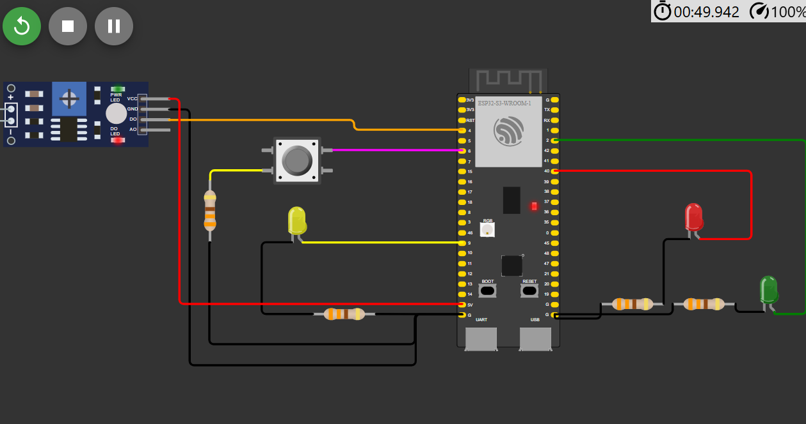
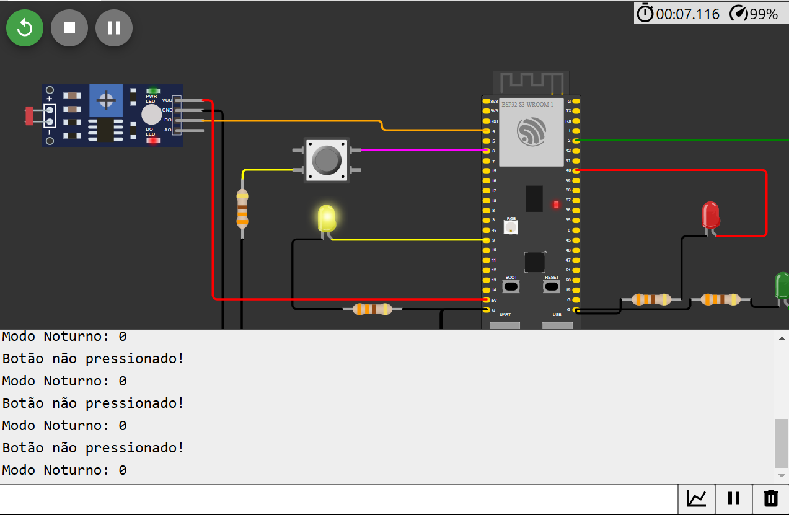
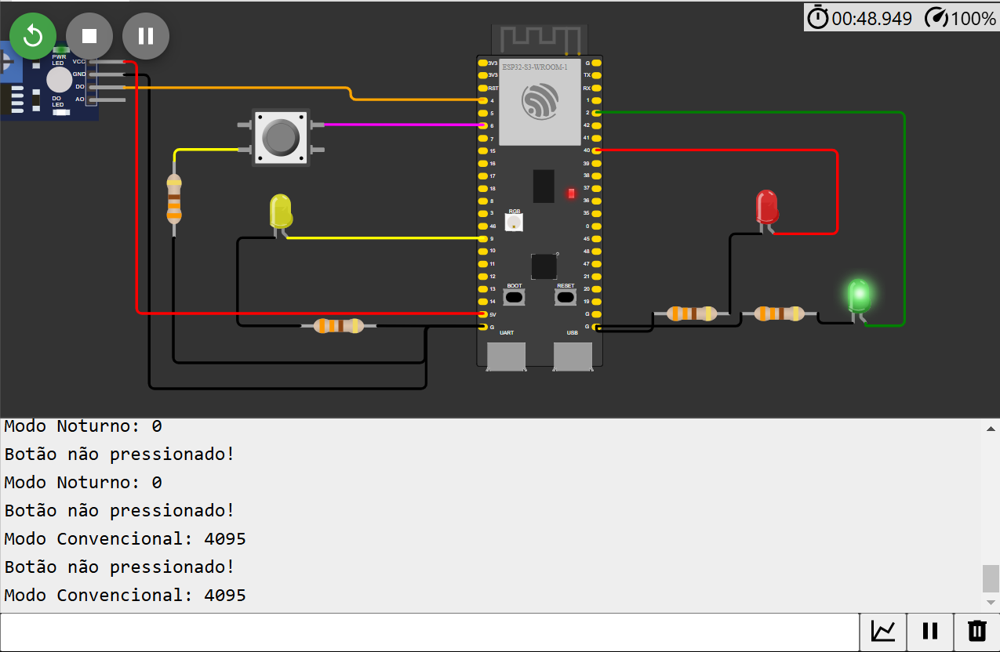
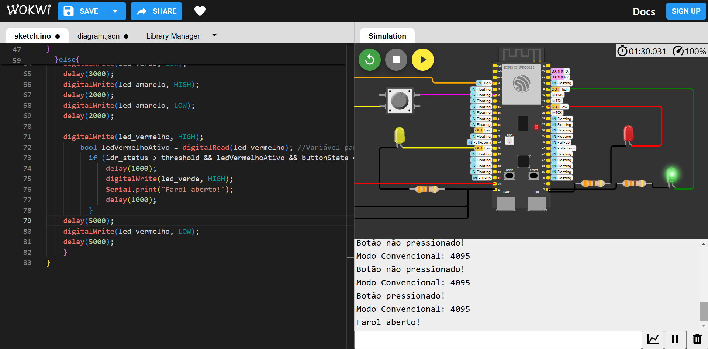

## Prova MÓDULO 04 - Programação

***Circuito Completo***

| Componente           | Quantidade | Descrição                                      |
|----------------------|------------|------------------------------------------------|
| ESP32          | 1          | Microcontrolador para controlar o circuito     |
| Sensor LDR           | 1          | Verifica a luminância do local/simulação      |
| LED (Vermelho)       | 1          | Indicador de "Pare" no farol simulado                             |
| LED (Amarelo)        | 1          | Indicador de "Atenção" no farol simulado                        |
| LED (Verde)          | 1          | Indicador de "Siga" no farol simulado                           |
| Resistores (330Ω)    | 3          | Para limitar a corrente dos LEDs               |
| Botão (Push Button)  | 1          | Inicia a condição do Estado 3                      |

Circuito no Wokwi 

   

Fonte: Material produzido pela autora (2024)

***Estado 1***
Quando estiver escuro (segundo a leitura analógica do sensor LDR), o protótipo deve ativar o modo noturno e piscar o led amarelo a cada segundo.

Circuito no Wokwi 

   

Fonte: Material produzido pela autora (2024)

***Estado  2***
Quando estiver claro (segundo a leitura analógica do sensor LDR), o protótipo deve ativar o modo convencional e fazer a temporização alternando entre verde (3 segundos), amarelo (2 segundos) e vermelho (5 segundos).

Circuito no Wokwi 

   

Fonte: Material produzido pela autora (2024)

***Estado 3***
 Quando estiver claro (segundo a leitura analógica do sensor LDR) e o semáforo estiver no estado fechado (somente led vermelho aceso) e o botão for pressionado, o semáforo deve abrir 1 segundo após o pressionamento do botão

 

Circuito no Wokwi 

   

Fonte: Material produzido pela autora (2024)

